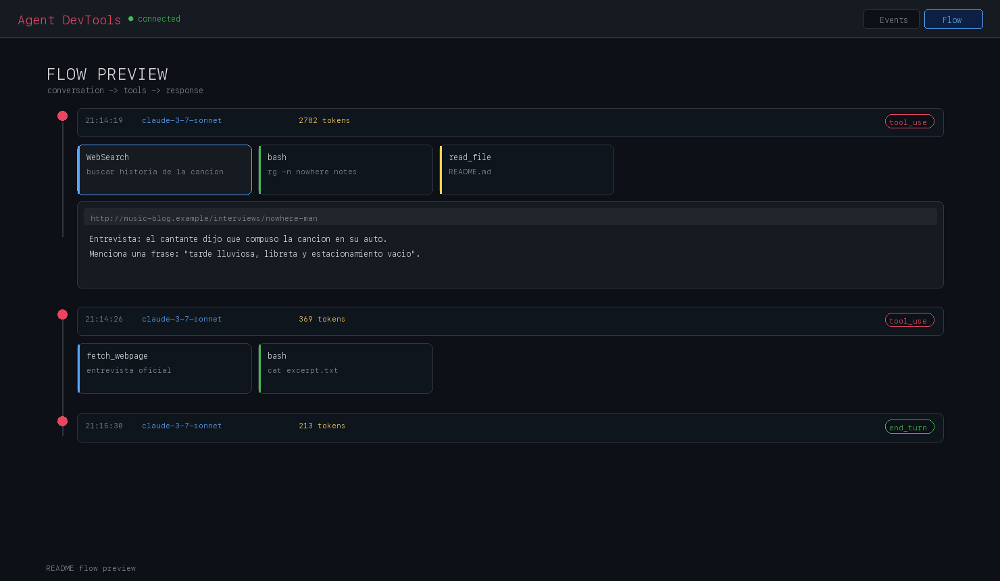

# Agent DevTools

Agent DevTools es un proxy de observabilidad en tiempo real para agentes de IA. Captura las llamadas entre Claude Code y Anthropic, y muestra los eventos en un dashboard local para inspeccionar requests, respuestas, tool calls y el flujo de ejecución.



## Qué incluye

- Proxy local para interceptar tráfico hacia Anthropic.
- Dashboard web con vista de eventos y vista de flujo.
- WebSocket en tiempo real para actualizar la interfaz al vuelo.
- Lanzador CLI para ejecutar Claude con la configuración necesaria.

## Requisitos

- Node.js 18 o superior, recomendado.
- npm.

## Instalación

```bash
npm install
```

## Desarrollo

```bash
npm run dev
```

Esto inicia el proxy y el dashboard en modo desarrollo.

## Compilación

```bash
npm run build
```

## Uso

### Lanzar Claude a través del proxy

```bash
npx agent-devtools claude
```

También puedes ejecutar el binario directamente una vez compilado:

```bash
node dist/index.js claude
```

### Uso manual

Si prefieres apuntar otra sesión o flujo manualmente, usa la variable de entorno:

```bash
ANTHROPIC_BASE_URL=http://localhost:4000
```

## Puertos

- Proxy HTTP: `http://localhost:4000`
- Dashboard web: `http://localhost:4001`
- WebSocket interno: `ws://localhost:4002`

## Scripts disponibles

- `npm run dev` inicia TypeScript con `ts-node`.
- `npm run build` compila a `dist/`.
- `npm start` ejecuta la salida compilada.
- `python3 scripts/generate-readme-gif.py` regenera la portada animada del README.

## Estructura del proyecto

- `src/index.ts`: arranque principal, proxy y dashboard.
- `src/proxy/`: lógica del proxy y parseo de respuestas de Anthropic.
- `src/dashboard/`: servidor del panel visual.
- `src/events/`: broadcast de eventos por WebSocket.
- `bin/agent-devtools.js`: entrada CLI publicada por npm.

## Notas

- El dashboard se abre automáticamente al iniciar la aplicación.
- Si no existe build del frontend, se sirve una versión inline del dashboard.
- El proyecto está pensado para integrarse con Claude Code y tráfico compatible con Anthropic.

## Licencia

MIT.